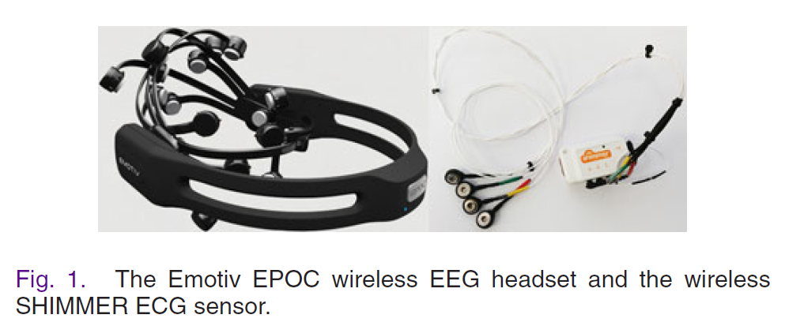

### Biosignal processing for automatic emotion recognition

#### by the Effective Affective Team 
##### AKA Danielle & Achraf
Made with GitPitch (thank you Agah!)

 Link to this presentation:
  
  https://gitpitch.com/brainhack-school2020/Biosignal-Emotions-BHS-2020 

---

### Detecting Stress?

Have you ever felt stress and didn't manage to communicate it?

Could your body speak it for you?

What about having a wearable that can dynamically inform us about it?

---

## Outline 

1. Project definition
2. Tools
3. Biosignal data
4. Decisions and replication
5. Building a classifier
6. What we learned in BHS2020

---

## Project idea

### Goal 
Predicting affective states based on biosignals for automatic stress detection in a wearable

### Dataset

DREAMER dataset: Participants were shown videos intended to elicit certain emotions while wearing an EEG headset and ECG sensors

 (The DREAMER dataset must be requested from the authors: https://zenodo.org/record/546113) 

---

### EEG & ECG Acquisition

---

## Tools

 Can read .MAT files in python 

 Example for EEG: Easy specification of bands (Theta, Alpha, Beta), PSD

 Interactive data visualization (Exploration) 

---

## Tools

Example for ECG: 2 lines to extract features!

---

### Big data ! Overview

23 subjects x 18 videos x 2 paradigms = 828 EEG recordings (x14 electrodes)!

##### Baseline & Stimulus

Challenge: Extract relevant features from all this!

---

#### Biosignal preprocessing : Feature extraction

EEG & ECG

 EEG: Features = Maximum of the PSD for each electrode for 3 bands: Theta (8-16Hz), Alpha (16-26Hz), Beta (26-60Hz)

 ECG: Neurokit2 automatically extracts features e.g. Mean Heart Rate, HRV 

---

### Exploring the data

---

### Exploring the data

---
#### Subjective ratings ↔ Physiological Features?

Pearson's correlation

##### Still challenging to find relevant features for automatic emotion recognition...

---
### Decisions, decisions...

- Biosignal data preprocessing?
- Feature selection method?
- What should we even predict?!

##### Replication of existing work? Not always straightforward!

---

### Affective data

<iframe src="https://brainhack-school2020.github.io/Biosignal-Emotions-BHS-2020/" width="1500" height="500" frameborder="0" marginwidth="0" marginheight="0"></iframe>

---

### Cross-validation

<iframe src="https://brainhack-school2020.github.io/Biosignal-Emotions-BHS-2020/DREAMER_group_cross_validation.html" width="1500" height="500" frameborder="0" marginwidth="0" marginheight="0"></iframe>

---
### Classifier comparison

<iframe src="https://brainhack-school2020.github.io/Biosignal-Emotions-BHS-2020/classifier_comparison_1000_500.html" width="100%" height="100%" frameborder="0" marginwidth="0" marginheight="0"></iframe>

---

### Future work

Experimenting with how classifier performance changes with...
- Our earlier decisions   
- Methods to reduce runtime  
- An entirely new dataset  

---

### What we learned in BHS2020

- More experience with GitHub 
- Deeper understanding of machine learning 
- Improved coding skills    
- Appropriate use of notebooks   vs. 
- Exposure to open science practices  

---

## Many thanks to the instructors and organizers!

 Agah, Greg, Loic, Yann
