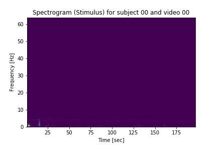
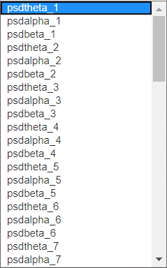

### Biosignal processing for automatic emotion recognition

#### by the Effective Affective Team 
##### AKA Danielle & Achraf
Made with GitPitch

 Link to this presentation :
  
  https://gitpitch.com/brainhack-school2020/Biosignal-Emotions-BHS-2020 

---

### Detecting Stress ?

Have you ever felt stress and didn't manage to communicate it ?

Could your body speak it for you ?

What about having a wearable that can dynamically inform us about it ?

---

## Outline 

1. Project definition
2. Tools
3. Biosignal data
4. Decisions and replication
5. Building a classifier
6. What we learned in BHS2020

---

## Project idea

### Goal 
Predicting affective states based on biosignals for automatic stress detection in a wearable

### Dataset

DREAMER dataset: Participants were shown videos intended to elicit certain emotions while wearing an EEG headset and ECG sensors

 (The DREAMER dataset must be requested from the authors : https://ieeexplore.ieee.org/document/7887697 ) 

---

### EEG & ECG Acquisition

---

## Tools

 Can read .MAT files in python 

 Example for EEG : Easy specification of bands (Theta, Alpha, Beta), PSD

 Interactive data visualization (Exploration) 

---

## Tools

Example for ECG : 2 lines to extract Features !

---

### Big data ! Overview

23 subjects x 18 videos x 2 paradigms = 828 EEG recordings (x14 electrodes)!

##### Baseline & Stimulus

Challenge : Extract relevant features from all this !

---

#### Biosignal preprocessing : Feature extraction

EEG & ECG

 EEG : Features = Maximum of the PSD for each electrode for 3 bands : Theta (8-16Hz), Alpha (16-26Hz), Beta (26-60Hz)

 ECG : Neurokit2 automatically extracts features e.g. Mean Heart Rate, HRV 

---

### Exploring the data

---

### Exploring the data

---
#### Subjective ratings ↔ Physiological Features ?

Pearson's correlation

##### Still challenging to find relevant features for automatic emotion recognition ...

---
### Decisions, decisions...

- How should we preprocess the biosignal data?
- Should we transform the data? How? MixMax scaling? Z-scoring?
- Which features should we use? 
- Should we divide features extracted from “stimuli” data (collected when emotional videos were played) by those extracted from “baseline” data?   
- What should we even predict?!

##### Replication of existing work? Not always straightforward!

---

### Affective data

<iframe src="https://brainhack-school2020.github.io/Biosignal-Emotions-BHS-2020/" width="1500" height="500" frameborder="0" marginwidth="0" marginheight="0"></iframe>

---

### Cross-validation

<iframe src="https://brainhack-school2020.github.io/Biosignal-Emotions-BHS-2020/DREAMER_group_cross_validation.html" width="1500" height="500" frameborder="0" marginwidth="0" marginheight="0"></iframe>

---
### Classifier comparison

<iframe src="https://brainhack-school2020.github.io/Biosignal-Emotions-BHS-2020/classifier_comparison_1000_500.html" width="100%" height="100%" frameborder="0" marginwidth="0" marginheight="0"></iframe>

---

### Future work

- Seeing how changing earlier decisions affects performance (e.g. preprocessing)
- Experimenting with methods to reduce prediction runtime
- Testing classifier performance on entirely new dataset

---

### What we learned in BHS2020

- More experience with GitHub
- New data visualization tools
- Deeper understanding of machine learning
- Better Python skills
- Appropriate use of notebooks (interactive visualizations vs. complex pipelines for HPC) 
- Exposure to open science tools and practices!

---

## Many thanks to the instructors and organizers!

Grag, Agah, Yann, ...
